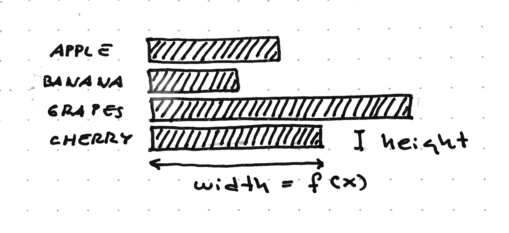
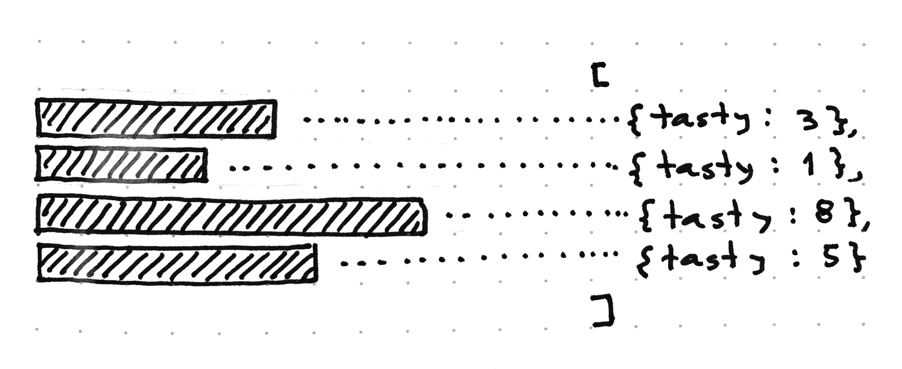
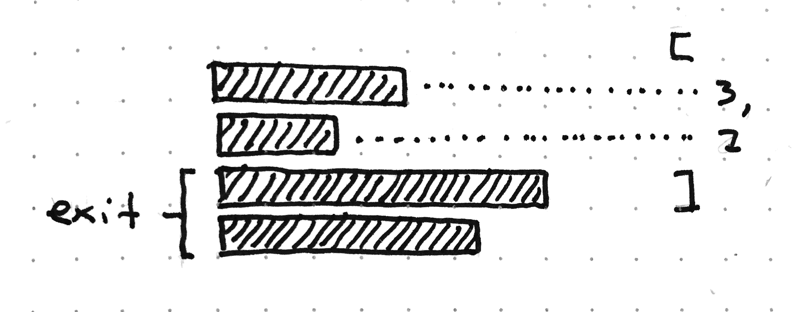
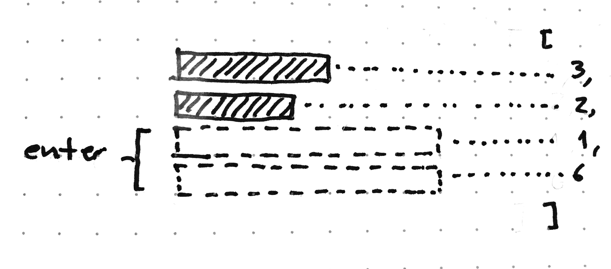

# Creating Reusable Charts with D3

_Pablo Navarro Castillo, Vancouver, May 2015_

## What is a Chart?

A chart is a _mapping_ between data attributes and visual attributes of objects representing the data items. The data attributes are encoded using position, colour, size or shape of the visual elements. In this example from from [xkcd](https://xkcd.com/388/), the position of visual items is used to represent the tastiness and easiness of eating fruits

Bar charts are more simple, we represent each data item with a rectangle of constant height, and represent one quantitative dimension of the data (tastiness) by changing the length of each rectangle

## Introduction to D3 (Data Driven Documents)

[D3.js](http://www.d3js.org) is a JavaScript library to bind data elements to documents and manipulate attributes of the documents based in the data bound to it. In this context, documents are DOM elements.

D3 is not a charting library, it doesn’t include scatter plots or bar charts, instead, it contains functions and methods to manipulate the mapping between data and visual objects directly. As D3 only manipulate DOM elements and their attributes, we only need to know HTML, CSS and Javascript to start creating graphics.

The first step to create a chart is to bind a data array with a [selection](https://github.com/mbostock/d3/wiki/Selections) of DOM elements. We can then manipulate the element attributes and style using the data bound to them.

<a class="jsbin-embed" href="http://jsbin.com/wefila/latest/embed?js,output">Data Binding</a>

In this example, we used a custom function to calculate the width of the bars, but it’s more easy to use D3’s [linear scale](https://github.com/mbostock/d3/wiki/Quantitative-Scales#linear-scales) to create the function that will help us to calculate the width of the bars

<a class="jsbin-embed" href="http://jsbin.com/gepuvi/latest/embed?html,js&height=600px">JS Bin</a>

In the previous examples, we already had 4 DIV elements and an array of exactly 4 elements. Most times, we will not have the same number of DOM elements than items in the data array. D3 handles this situation nicely creating special selections for elements without bound data and for data elements without DOM elements.

### The Selection Lifecycle

The usual way to create charts and visualisations with D3 is to create a function that takes a selection with bound data and create the charts, create a selection, bind a data array and invoke the charting function. Every time our data changes, or when we change the charting function parameters, we will bind the new data array and call the charting function again.

Our charting function needs to handle both situations, having less DOM elements than data items and having too many. We will review how to handle this before learning how to create charts

### Exit Selection (Removing)

If there are more DOM elements that data items, the remaining DOM elements will be stored in the [exit selection](https://github.com/mbostock/d3/wiki/Selections#exit). These elements can be manipulated in the same way that regular selections, except that they don’t have bound data items

<a class="jsbin-embed" href="http://jsbin.com/wilaja/latest/embed?html,js&height=700px">JS Bin</a>

### Enter Selection (Creating)

If there are less or no DOM elements than data items, D3 will create placeholder DOM elements, bind the data to them and store them in the [enter selection](https://github.com/mbostock/d3/wiki/Selections#enter). These DOM elements are not fully-formed elements and thus, we cannot manipuate their attributes until we create an _actual_ DOM element, by using [append](https://github.com/mbostock/d3/wiki/Selections#append) or [insert](https://github.com/mbostock/d3/wiki/Selections#insert)

<a class="jsbin-embed" href="http://jsbin.com/tosubi/latest/embed?js,output&height=700px">JS Bin</a>

We will simplify a bit our code before creating a proper charting function

<a class="jsbin-embed" href="http://jsbin.com/canawi/latest/embed?html,js&height=900px">Simplifying</a>

The patters is always the same, create a selection, bind the data array, create elements on enter, update existing elements and remove items on the exit selection. If we forget one of this steps we might end up with extra DOM elements, or updating the wrong items

[Next: Creating Charts](charting-function.html)
